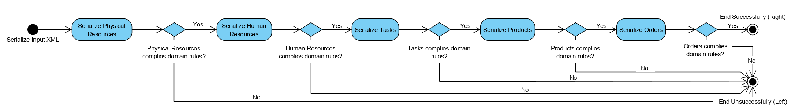

# Production Schedule

The present project was developed in the scope of the curricular unit Técnicas Avançadas de Programação (TAP) of Mestrado em Engenharia Informática (MEI) at Instituto Superior de Engenharia do Porto (ISEP). This project aims to address the scheduling of production orders in a factory.

The development was divided in three milestones, being the first one a Minimum Viable Product (MVP) implementation of the scheduling algorithm, followed by the development of property-based testing for the domain, and the third one, a refinement to the scheduling algorithm with scheduling optimization.

Team Members:

    - Rute Santos (1160663)
    - Filipe Ferreira (1160826)
    - Vera Dias (1160941)

## Domain Concepts

After analyzing the requirements described in the statement, the following domain model was built:

|  |
| :--: |
| Domain Model.|


| **Class** | **Description** |
| :---: | :--- |
| HumanResource | Entity that contains all the information for a Human Resource, it's identified by a String Id, name of the Human Resource and a list of *skills* that will be used to establish a connection with PhysicalResource that will be used in the entity *Task*. |
| Order | This is one of the main input concepts in this domain. Identified by a *String* type *Id* and references a product and the required production quantity. Through its product, it is possible to reach all the entities necessary for the fulfillment of the *Order*. |
| PhysicalResource | Identified by an Id of the type *String*, this entity contains the *ResourceType* that will be used to establish a connection with HumanResource with the ability to operate it and the need to use it in a *Task*.  |
| Product | The products contain production processes, which consist of the *Tasks* with *ResourceType* necessary for it to be successfully built. An *id* is required to identify the product in a *Order* and a specific name is required. |
| ResourceType | This entity is transversal to several other entities in the domain (*HumanResource*, *PhysicalResource*, *Production*, *Task*) and consists of the types of resources that the system supports. |
| Task | This entity is the related to a *Product* since a Product contains a list of tasks necessary to be created. A *Task* has an Id of type String, a time in unit time and a list of *Resource Types*. |
| TaskSchedule | The final result of running this application should be a set of *TaskSchedule*. This entity presents all the *Human* and *Physical*, necessary for a given *Order* of a *Product*. The required time interval is represented by *StartTime* and *EndTime*. |
| Production | The Production is the entity that contains everything necessary to create a *Schedule*. The Production has a list of *Orders*, a list of possible *Products*, a list of *Tasks*, a list *Physical Resources*, a list of available *Resource Types* and a list of *Human Resources*. To create a Schedule, it's necessary to contact Production to know all the resources available. |

<div style="page-break-after: always; break-after: page;"></div>

## Domain Validations

Input validations are required for entity identifiers. The following Regex expressions were used:

| **Class** | **Validations** |
| :---: | :--- |
| HumanResource | - ID must follow the pattern `HRS_[1-9][0-9]*` - Name must not be null or empty |
| Order | - ID must follow the pattern `ORD_[1-9][0-9]*` - Quantity must be bigger than 0 |
| PhysicalResource | - ID must follow the pattern `PRS_[1-9][0-9]*` |
| Product | - ID must follow the pattern `PRD_[1-9][0-9]*` - Name must not be null or empty |
| ResourceType | - Must follow the pattern `PRST [1-9][0-9]*` |
| Task | - ID must follow the pattern `TSK_[1-9][0-9]*` - Time must be bigger than 0 |

<div style="page-break-after: always; break-after: page;"></div>

## Milestones

### Milestone 1 (MS01)

#### XML File Parse

For this iteration there are two main flows using XML, the (i) input and (ii) output. 

##### Input

This part starts in the *ScheduleResolver* class. For this, the input xml is used to create a *Production* object from a XML Node. To create a *Production* object it's also necessary to create everything else. To do this the method *traverse* is used for each attribute of the Production element. To create a Production element, is necessary to serialize the *Physical Resources*, if this does not comply to the domain rules (described in the *Domain Validations*) then the serialization is unsuccessful and it's generated a error in the file. In the case that the *Physical Resource* is valid then it's necessary to Serialize the Human Resources that will follow a similar flow described above. After this, the *Tasks* serialized (this will fail if the tasks do not comply the domain rules), after this the *Products* are serialized and after that the *Orders*. Every object should respect the domain rules so that the end is successful and the algorithm can generate a *Task Schedule*. This flow should be sequential since a *Order* needs a *Product*, a *Product* needs a list of *Tasks* and this has a list of *Resource Types* that are used by *Human Resources* and *Physical Resources*.

 The following diagram represents the flow of serialization before the algorithm begins.

|  |
|:--:|
| State diagram for the serialization of algorithm input. |


#### Output

After the algorithm generates a list of *Task Schedule* it is necessary to generate a XML file that has each individual element of Task Schedule. Each element is serialized using an auxiliary method in the *XMLParser* class. For each Task Scheduler element there is a *order id*, *product number*, *task id*, *start* and *end*, a list of *Physical Resources* and a list of *Human Resources*. For each serialization, the **scala.xml** library is used to create a flexible XML node, the following approach was used:

```scala
    <A attribute={ value1 }>
      { value2 }
    </A>;
```

Each serialization returns a Elem that after all the serialization finishes the Elem is written in a file using the method save() from the auxiliary class XML in the project. If a error occurs along the whole process the serialization does not occur, and a DomainError is returned instead of an Elem.

#### Scheduling Algorithm

The development of the algorithm is distributed among different classes of the package **Schedule**:

|  |
|:--:|
| Schedule package model. |

The algorithm for the creation of **Schedule** uses *tail recursion* and consists on the following steps:
- Iterate each *Order* that *Production* contains;
- Call recursively a method to create a TaskSchedule as many times as the *productNumber* it contains;
- This recursive call will stop when the *productNumber* is reached and does the sum required to *startTime* and *endTime*; 
- During each recursive iteration, the necessary and available *Physical* and *Human* for the task is obtained;
- The final output is a list of type *TaskSchedule*.

<div style="page-break-after: always; break-after: page;"></div>

The diagram below describes the phases of execution of the algorithm: 

|  |
| :--: |
| Sequence diagram of Algorithm. |

#### Future Improvements

There are some aspects that should be improved on the next iterations, such as:

* A service layer should be created to accommodate auxiliary methods that are used in the domain layer. Some methods that would fall in this category are *findHuman* and *findPhysical* in MS01Scheduler class;
* It's a good practice to add explicit type notation. This should be used whenever possible;
* There are some warnings that are shown when the program is compiled using the terminal. These warnings should be assessed;
* Finally, also as a good practice, the use of *head* should be avoided.

<div style="page-break-after: always; break-after: page;"></div>

### Milestone 2 (MS02)

#### Properties for the Problem Domain

1. The same resource cannot be used at the same time by two tasks.
2. The complete schedule must schedule all the tasks of all the *Products* needed.
3. The number of *TaskSchedules* must be the same as the result of the multiplication between the *Tasks* and the *quantity* of the *Product* in an *Order*.
4. The end time of the last *TaskSchedule* must be equal to the multiplication between the sum time of the *Tasks* and the *quantity* of the *Product* in each *Order*.
5. The schedule should not be implemented when there are not enough resources (*PhysicalResource* and *HumanResource*) to process the Task Schedule. 
6. The sum of the *TaskSchedule* time of an order should be equal to sum of the times of the *Task* multiplied by the *quantity*.
7. The *TaskSchedules* can't contain *PhysicalResource* that is not valid.
8. The *TaskSchedules* can't contain *HumanResource* that is not valid.
9. The highest *productNumber* for each *Order* should be equal to the *quantity* to that *Order*.
10. For a given *TaskSchedule*, the list of *PhysicalResource* can't have repeated elements
11. For a given *TaskSchedule*, the list of *HumanResource* can't have repeated elements
12. For a given *TaskSchedule*, the number of *PhysicalResources* should be equal to the number of *HumanResources*

<div style="page-break-after: always; break-after: page;"></div>

#### Generators

| **Generator** | **Description** |
| :--- | :--- |
| `idGenerator[A](prefix: String, getId: String => Result[A]): Gen[A]` | Generates an unique identifier with a specified prefix |
| `idGenerator[A](prefix: String, number: Int, getId: String => Result[A]): Gen[A]` | Generates an unique identifier with a specified prefix of Type A using function getId to convert String into A |
| `nameGenerator[A](getName: String => Result[A]): Gen[A]` | Generates a random string and convert to a *SimpleType* |
| `filteredListGenerator[A](list: List[A]): Gen[List[A]]` | Pick some elements from a generated list |
| `listGenerator[A](generator: Int => Gen[A]): Gen[List[A]]` | Generates a list of elements as well as its size |
| `listGenerator[A](size: Int, generator: Int => Gen[A]): Gen[List[A]]` | Recursive generator that receives size of list to generate |
| `physicalResourceGenerator(id: Int): Gen[PhysicalResource]` | Generates a valid physical resource with a received ID |
| `listPhysicalResourceGenerator: Gen[List[PhysicalResource]]` | Generates a list of valid physical resources without repeated IDs |
| `humanResourceGenerator(resourceTypesList: List[ResourceType])(id: Int): Gen[HumanResource]` | Generates a valid human resources  with a given ID |
| `listHumanResourceGenerator(resourceTypesList: List[ResourceType]): Gen[List[HumanResource]]` | Generates a list of valid human resources without repeated IDs |
| `taskGenerator(resourceTypesList: List[ResourceType])(id: Int): Gen[Task]` | Generates a valid task referring valid resources, with a received unique identifier |
| `listTaskGenerator(resourceTypesList: List[ResourceType]): Gen[List[Task]]` | Generates a valid list of task without repeated IDs |
| `productGenerator(taskList: List[Task])(id: Int): Gen[Product]` | Generates a valid product with a given ID referring valid tasks |
| `listProductGenerator(taskList: List[Task]): Gen[List[Product]]` | Generates a valid list of product without repeated IDs |
| `orderGenerator(productList: List[Product])(id: Int): Gen[Order]` | Generates a valid order with a unique identifier, referring to a valid product |
| `listOrderGenerator(productList: List[Product]): Gen[List[Order]]` | Generates a valid list of order without repeated IDs |
| `productionGenerator: Gen[Production]` | Generates a valid production |
| `productionGeneratorPhysicalResourceUnavailable: Gen[(Production, TaskId, ResourceType)]` | Generates an invalid production where there are not enough PhysicalResources to complete a task of an order |
| `productionGeneratorHumanResourceUnavailable: Gen[(Production, TaskId, ResourceType)]` | Generates an invalid production where there are not enough HumanResources to complete a task of an order|

<div style="page-break-after: always; break-after: page;"></div>

#### Properties for the Generators

1. listPhysicalResourceGenerator should not generate list with repeated ids.
2. listHumanResourceGenerator should not generate list with repeated ids.
3. listTaskGenerator should not generate list with repeated ids.
4. listProductGenerator should not generate list with repeated ids.
5. listOrderGenerator should not generate list with repeated ids.
6. listPhysicalResourceGenerator should generate list within *MIN_LIST_SIZE* e *MAX_LIST_SIZE*.
7. listTaskGenerator should generate list within *MIN_LIST_SIZE* e *MAX_LIST_SIZE*.
8. listProductGenerator should generate list within *MIN_LIST_SIZE* e *MAX_LIST_SIZE*.
9. listOrderGenerator should generate list within *MIN_LIST_SIZE* e *MAX_LIST_SIZE*.
10. listHumanResourceGenerator should generate a list with the same number of elements of the ResourceType list.


#### Previous Milestone Improvements
* After testing with the new evaluation files (*validAgenda_11_in.xml* and *validAgenda_12_in.xml*) some logic errors were detected, sometimes the **PhysicalResource** chosen by the algorithm is used more than once for a given task. This bug has been corrected; 
* Creation of input and output files to test the algorithm.


#### Future Improvements
* There are some warnings that are shown when the program is compiled using the terminal. These warnings should be assessed;